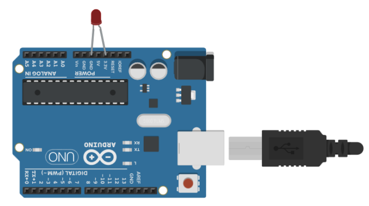
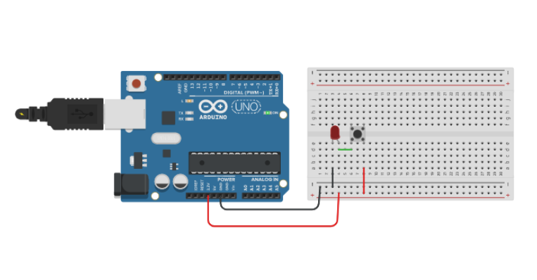
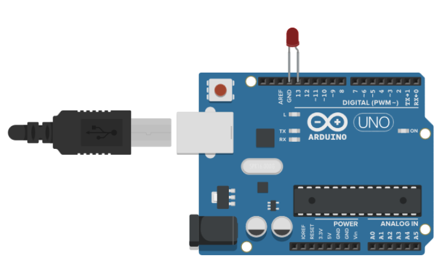
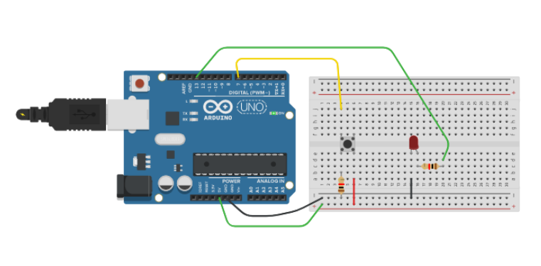
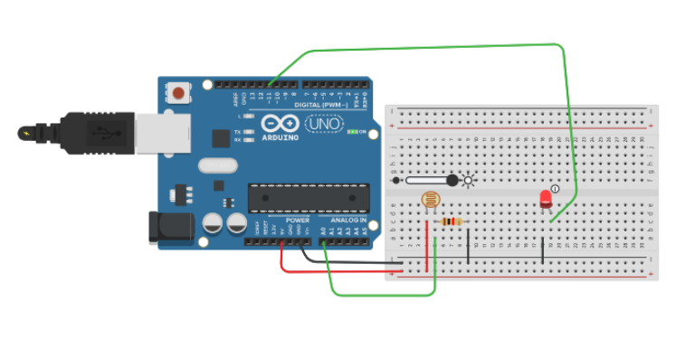
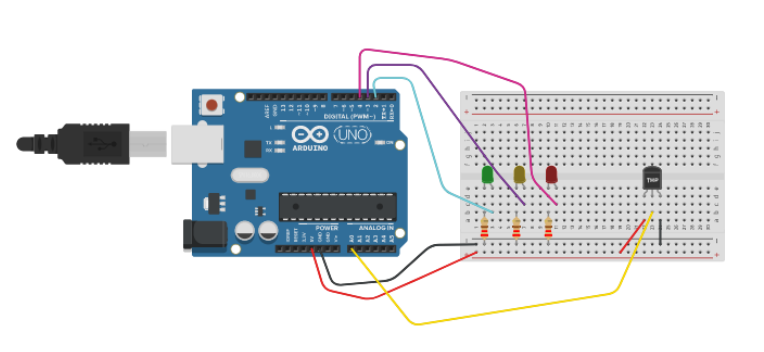
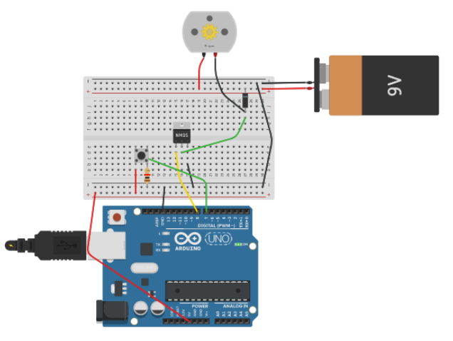
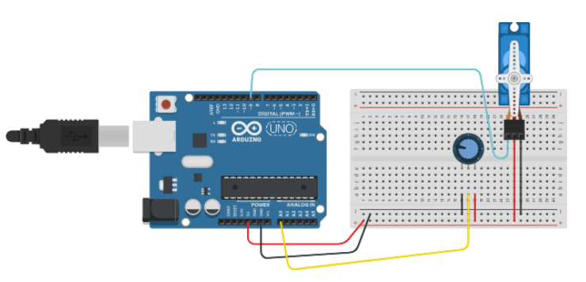

## Atelier electronique / arduino

--------

#### exemple 1 : Make a led glow
[Test me on Tinkercad](https://www.tinkercad.com/things/03WDZBVcr39)

Arduino Code :
```java
///Nothing here
```
--------
#### exemple 2 : Make a led glow with a button
[Test me on Tinkercad](https://www.tinkercad.com/things/163mTSp0VBm)

Arduino Code :
```java
///Nothing here
```
--------

#### exemple 3 : Make a led blink
[Test me on Tinkercad](https://www.tinkercad.com/things/163mTSp0VBm)


Arduino Code :
```java
void setup()
{
  pinMode(13, OUTPUT);
}

void loop()
{
  digitalWrite(13, HIGH);
  delay(1000); // Wait for 1000 millisecond(s)
  digitalWrite(13, LOW);
  delay(1000); // Wait for 1000 millisecond(s)
}
```
--------
#### exemple 4 : Use a programmed button
[Test me on Tinkercad](https://www.tinkercad.com/things/cKW6QXsZYLM)

Arduino Code :
```java
int diode = 13;
int button = 7;

void setup() {
  pinMode(diode, OUTPUT);
  pinMode(button, INPUT);
}

void loop() {
  //SI bouton appuyé
  if (digitalRead(button) == HIGH){
    //ALORS
    digitalWrite(diode, LOW);
  } else {
    //sinon...
    digitalWrite(diode, HIGH);
  }
}
```
--------

#### exemple 5 : Use a light sensor
[Test me on Tinkercad](https://www.tinkercad.com/things/14qDVw4yCpc)


Arduino Code :
```java
int sensorPin = A0;    // select the input pin for the light sensor
int ledPin = 11;      // select the pin for the LED
int sensorValue = 0;  // variable to store the value coming from the sensor

void setup() {
  // declare the ledPin as an OUTPUT and sensorPin as INPUT
  pinMode(ledPin, OUTPUT);
  pinMode(sensorPin, INPUT);
  Serial.begin(9600);
}

void loop() {
  sensorValue = analogRead(sensorPin);  // read the value from the sensor
  Serial.println(sensorValue);  // tell us the current luminosity
  analogWrite(ledPin, sensorValue / 4); // change LED intensity depending of the luminosity
  delay(50);
}
```
--------

#### exemple 6 : Blink with the heat
[Test me on Tinkercad](https://tinkercad.com/things/88JZm8U2yei)


Arduino Code :
```java
// named constant for the pin the sensor is connected to
const int sensorPin = A0;
// room temperature in Celsius
const float baselineTemp = 20.0;

void setup() {
  // open a serial connection to display values
  Serial.begin(9600);
  // set the LED pins as outputs
  // the for() loop saves some extra coding
  for (int pinNumber = 2; pinNumber < 5; pinNumber++) {
    pinMode(pinNumber, OUTPUT);
    digitalWrite(pinNumber, LOW);
  }
}

void loop() {
  // read the value on AnalogIn pin 0 and store it in a variable
  int sensorVal = analogRead(sensorPin);

  // send the 10-bit sensor value out the serial port
  Serial.print("sensor Value: ");
  Serial.print(sensorVal);

  // convert the ADC reading to voltage
  float voltage = (sensorVal / 1024.0) * 5.0;

  // Send the voltage level out the Serial port
  Serial.print(", Volts: ");
  Serial.print(voltage);

  // convert the voltage to temperature in degrees C
  // the sensor changes 10 mV per degree
  // the datasheet says there's a 500 mV offset
  // ((voltage - 500 mV) times 100)
  Serial.print(", degrees C: ");
  float temperature = (voltage - .5) * 100;
  Serial.println(temperature);

  // if the current temperature is lower than the baseline turn off all LEDs
  if (temperature < baselineTemp + 2) {
    digitalWrite(2, LOW);
    digitalWrite(3, LOW);
    digitalWrite(4, LOW);
  } // if the temperature rises 2-4 degrees, turn an LED on
  else if (temperature >= baselineTemp + 2 && temperature < baselineTemp + 4) {
    digitalWrite(2, HIGH);
    digitalWrite(3, LOW);
    digitalWrite(4, LOW);
  } // if the temperature rises 4-6 degrees, turn a second LED on
  else if (temperature >= baselineTemp + 4 && temperature < baselineTemp + 6) {
    digitalWrite(2, HIGH);
    digitalWrite(3, HIGH);
    digitalWrite(4, LOW);
  } // if the temperature rises more than 6 degrees, turn all LEDs on
  else if (temperature >= baselineTemp + 6) {
    digitalWrite(2, HIGH);
    digitalWrite(3, HIGH);
    digitalWrite(4, HIGH);
  }
  delay(1);
}
```
--------


#### exemple 7 : Use 9V to power a strong motor
[Test me on Tinkercad](https://www.tinkercad.com/things/6PE1Yd0HUkL)


Arduino Code :
```java
void setup() {
  pinMode(8, OUTPUT);
  pinMode(7, INPUT);
}

void loop(){
  if ( digitalRead(7) == HIGH ) {
    digitalWrite(8, HIGH);
  }  else {
	digitalWrite(8, LOW);
  }
}
```
--------

#### exemple 8 : Have fun with a servo motor
[Test me on Tinkercad](https://www.tinkercad.com/things/ia83eHY1JRs)


Arduino Code :
```java
#include <Servo.h>

Servo myservo;  // create servo object to control a servo

int potpin = 0;  // analog pin used to connect the potentiometer
int val;    // variable to read the value from the analog pin

void setup() {
  myservo.attach(9);  // attaches the servo on pin 9 to the servo object
  Serial.begin(9600); // open a serial connection to your computer

}

void loop() {
  val = analogRead(potpin);            // reads the value of the potentiometer (value between 0 and 1023)

  Serial.print("potVal: ");
  Serial.print(val);
  val = map(val, 0, 1023, 0, 180);     // scale it to use it with the servo (value between 0 and 180)
  myservo.write(val);                  // sets the servo position according to the scaled value
  delay(15);                           // waits for the servo to get there
  // print out the angle for the servo motor
  Serial.print(", angle: ");
  Serial.println(val);
}
```
--------
